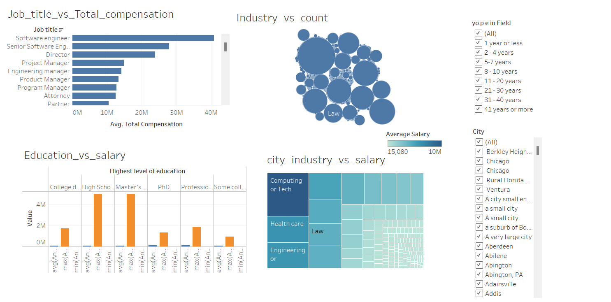

# Career Trajectories: Analyzing Salary and Experience Across Industries

## 📊 Project Overview
This project explores global salary trends across multiple industries, roles, education levels, and demographics to uncover the key drivers of compensation. By leveraging data cleaning, SQL analysis, and data visualization, the study provides deep insights into how salary varies with experience, gender, location, and job title.

## 🔍 Key Objectives
- Identify industries and job roles with the highest and lowest average salaries.
- Analyze the impact of education level and gender on compensation.
- Discover trends in salary based on age and years of experience.
- Evaluate additional monetary compensation across demographics.

## 🧮 Dataset Overview
- **Initial size:** 28,104 rows × 16 columns  
- **Final cleaned dataset:** 17,007 rows × 16 columns  
- **Cleaning steps:**
  - Removed blank and irrelevant columns
  - Standardized column names and fixed data types
  - Removed outliers (e.g., salaries below minimum wage)

## 🛠️ Tools & Technologies
- **SQL:** For querying and deriving insights from cleaned data
- **Excel / Power BI / Tableau (optional):** For creating dashboards and visualizations
- **Python (optional):** For preprocessing (if applicable)

## 📈 Key Insights
- **Top-paying industries:**  
  - Computing: $535K  
  - Consulting: $519K  
  - Law: $448K

- **Lowest-paying industries:**  
  - Restaurant: $15K  
  - Auction House: $20K  
  - Pet Care: $25K

- **Top compensated job titles:**  
  - Software Engineer  
  - Director  
  - Senior Software Engineer

- **Gender & Bonus Distribution:**  
  - Men: 70% receive bonuses  
  - Women: 61%  
  - Non-binary/Others: 50%

- **Salary Trends by Age:**  
  - Men peak from mid-20s to mid-50s  
  - Women’s salaries rise steadily with age  
  - Non-binary individuals have highest earnings under 18 and again in later years

## 📌 Takeaways
- **Industries:** Computing, Consulting, and Law offer the best compensation.
- **Roles:** Tech and leadership roles dominate total compensation.
- **Education:** Professional degrees yield highest returns.
- **Experience:** Tech values young talent; healthcare and education favor veterans.
- **Gender Gap:** Bonus distribution still reflects disparities.
